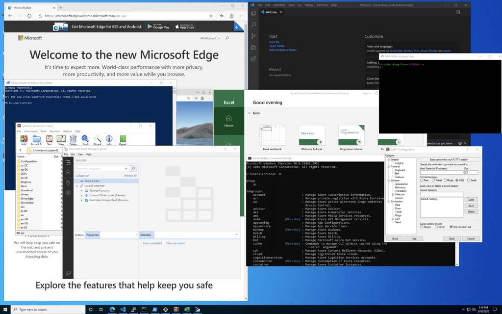

# Az Kung Fu - Adminstrator & DevOps VM!


Have you ever spent hours building a machine to use as an Azure Administrator or DevOps workstation? There's a lot of tools to install. Oh, and what about installing Windows Subsystem for Linux?  Then this one click deployment is for you.  Use this VM to start down the path of [az-kung-fu](https://github.com/build5nines/az-kung-fu) grasshopper!

<a href="https://portal.azure.com/#create/Microsoft.Template/uri/https%3A%2F%2Fraw.githubusercontent.com%2FBuild5Nines%2Faz-kung-fu-vm%2Fmaster%2Fazure-deploy.json" target="_blank">
    
</a>

_Click the "Deploy to Azure" button to deep link into the Azure Portal to deploy this Az Kung Fu VM to become an Azure Administrator Master!_

This repo is part of the larger [**Az Kung Fu**](http://github.com/build5nines/az-kung-fu) project from [Dan Patrick](https://build5nines.com/author/deltadan) and [Chris Pietschmann](https://build5nines.com/author/crpietschmann/).

## Software included on the VM

This virtual machine template is meant to easily create a sort of "power tools" style VM for Azure Administrators, as well as Developers and other roles, to use for more easily having a great Azure CLI scripting environment. The template automatically installs lots of really great tools for this purpose.

1. Chocolatey Package Manager
1. Office 365 Pro Plus
1. Azure Storage Explorer
1. Azure Powershell
1. Azure CLI (Windows)
1. Azure CLI (bash - manual install)
1. Git for Windows (bash)
1. Microsoft Edge
1. Putty
1. SysInternals
1. Visual Studio Code
1. Kubernetes CLI
1. Kubernetes Helm
1. Terraform CLI
1. Windows Subsystem for Linux (Ubuntu 18.04)
1. WinRar
1. 7-Zip

## Credentials
1. User: Supplied on deploy
1. Password: Supplied on deploy



## Configure Windows Subsystem for Linux

Once the Azure CLI Kung Fu VM is deployed, you can easily setup the Ubuntu for Windows using WSL by clicking the shortcut icon right on the Desktop:

1. Double-click Install Ubuntu on Desktop, click Install.
1. Follow prompts to install providing UNIX username and password.
1. Run the following command to install the Azure CLI into WSL

```
sudo apt-get update -y && curl -sL https://aka.ms/InstallAzureCLIDeb | sudo bash
```


